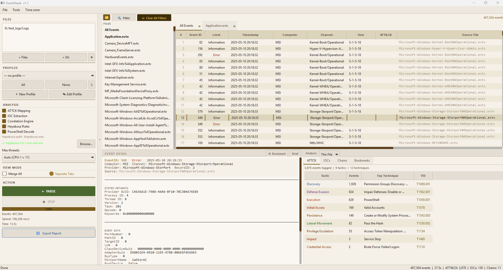

<p align="center">
  
  <h1 align="center">EventHawk</h1>
  <p align="center">Windows Event Log analysis built for DFIR — fast, scalable, and practical</p>
  <p align="center">
    
    
    
    
    
  </p>
</p>

---

Whether you are triaging a suspected incident, hunting for lateral movement across thousands of machines, or just trying to make sense of a pile of `.evtx` files — EventHawk is the tool that gets out of your way and lets you focus on the investigation.

It parses Windows Event Logs in parallel using a Rust-backed engine, loads results into a clean Qt GUI, and gives you filters, threat analysis, IOC extraction, and timeline correlation all in one place. When the dataset is too large for memory, **Juggernaut Mode** takes over — keeping RAM flat by offloading raw event data to Parquet on disk and running all queries through DuckDB against a compact in-memory Arrow table. For deeper investigations, the bundled **Sentinel** engine builds a statistical baseline of normal behaviour and flags anything that deviates from it, even if no Sigma rule exists for it.



---

## Why EventHawk?

### For large-scale parsing

✅ **Multi-process Rust parser** — `pyevtx-rs` does the heavy lifting per worker. More cores = more files in parallel. A resource monitor keeps the system responsive by throttling workers if CPU or RAM pressure spikes.

✅ **Juggernaut Mode** — Arrow + DuckDB columnar engine keeps RAM flat regardless of event count. Raw event XML stays on disk; only extracted metadata columns live in memory. Scroll 10 million events with zero I/O.

✅ **20 built-in DFIR profiles** — filter at parse time, not after. Load only the events that matter for your investigation type and skip the noise entirely.

### For analysis and investigation

✅ **273+ event ID descriptions** — EventHawk translates raw event data into plain English. Click Event 4624 and see *"Logon: john@CORP — Interactive (Type 2) from 192.168.1.5"*, not raw XML.

✅ **4-layer filter stack** — filter by event ID, level, time range, computer, provider, user, channel, and free-text (including raw event data) — all simultaneously, all clearable in one click.

✅ **ATT&CK mapping and IOC extraction** — every parse automatically maps events to MITRE ATT&CK techniques, extracts IPs, file paths, hashes, domains, and user accounts, and correlates them into multi-step attack chains.

✅ **Hayabusa integration** — point EventHawk at the Hayabusa binary and get ~3,000 community Sigma rules evaluated against your loaded files, merged into the ATT&CK tab alongside EventHawk's own detections.

✅ **PowerShell History extraction** — reconstruct every PowerShell session, command, and script block from loaded EVTX files. Reassembles multi-fragment script blocks, detects ATT&CK techniques and obfuscation patterns, and exports five artefacts: session timeline, individual script block files, summary, JSON export, and an Excel timeline with clickable hyperlinks.

### For unknown threats

✅ **Sentinel anomaly engine** — builds a statistical frequency model + process ancestry trie + fuse filter from a known-good baseline corpus. Scores every process-create event in a suspect capture. A Tier 4 alert means something happened that was never seen in baseline — even with no Sigma rule for it.

✅ **Natural-language justifications** — every Tier 3/4 finding includes a plain-English explanation: *"wscript.exe has NEVER spawned powershell.exe in baseline (0 occurrences). Encoded command pattern not seen in baseline."*

### For output and reporting

✅ **Export in 8 formats** — JSON, CSV, XML, self-contained HTML, PDF investigation report, STIX 2.1, OpenIOC, YARA rules generated from observed IOCs.

✅ **Full CLI + TUI** — every GUI feature is accessible headlessly for scripting, automation, and server environments.

---

## Quick Start

```bat
REM Launch the GUI
EventHawk.exe
REM  — or from source —
py -3 evtx_tool.py gui

REM Parse a folder, apply a DFIR profile, export to JSON
py -3 evtx_tool.py parse C:\Logs --profile "Logon/Logoff Activity" --output results.json

REM Large dataset — Juggernaut Mode keeps RAM flat regardless of event count
py -3 evtx_tool.py parse C:\LargeCapture --juggernaut --workers 8

REM Sentinel — build a behaviour baseline, then score a suspect capture
python -m sentinel.cli build   --evtx C:\Baseline --output baseline/ --sigma C:\sigma\rules\windows
python -m sentinel.cli analyze --evtx C:\Target   --baseline baseline/ --sigma C:\sigma\rules\windows
```

---

## What's Inside

| | |
|---|---|
| **Two parsing modes** | Normal Mode for everyday datasets (in-memory, instant access). Juggernaut Mode for large captures — Arrow table holds only metadata columns; raw event XML stays on disk and is lazy-loaded on row click. |
| **20 built-in DFIR profiles** | Logon/Logoff, Process Creation, Lateral Movement, Privilege Escalation, PowerShell, RDP, Defender Alerts, and 13 more. Load one before parsing to cut noise immediately. |
| **273+ event ID descriptions** | EventHawk knows what a 4624 means, what a 7045 means, what a 1116 means. Click a row and get a plain-English description instead of raw XML. |
| **4-layer filter stack** | Advanced filter, quick filter chips, full-text search (including raw event data in JM), and record-ID pivot — all combinable, all clearable in one click. |
| **Threat analysis** | MITRE ATT&CK mapping, IOC extraction, attack-chain correlation. |
| **Hayabusa integration** | Point EventHawk at your Hayabusa binary and it runs ~3,000 community Sigma rules against the loaded files, merging results into the ATT&CK tab. |
| **PowerShell History extraction** | Reconstructs PS sessions, commands, and script blocks (EID 400/403/600/800/4103/4104). Reassembles multi-fragment script blocks, maps ATT&CK techniques, and exports a session timeline, individual script files, JSON, and an Excel workbook with clickable hyperlinks. |
| **Sentinel anomaly engine** | Builds a frequency model + process ancestry trie + fuse filter from a known-good corpus. Scores every process-create event in a suspect capture and classifies findings into 4 tiers (T1 normal → T4 critical). |
| **Export everywhere** | JSON, CSV, XML, HTML, PDF report, STIX 2.1, OpenIOC, YARA. |
| **CLI + TUI** | Full headless CLI for scripting and automation. Rich terminal dashboard for live parse progress. |

---

## Documentation

### Getting Started

| | |
|---|---|
| [Installation](docs/01-installation.md) | Pre-built EXE vs from source, GPU acceleration, dependency troubleshooting |
| [GUI Overview](docs/02-gui-overview.md) | Window layout, panel descriptions, how to launch |

### Parsing Modes

| | |
|---|---|
| [Normal Mode](docs/03-normal-mode.md) | How it works, when to use it, step-by-step, performance, limitations |
| [Juggernaut Mode](docs/04-juggernaut-mode.md) | Arrow + DuckDB columnar engine, memory architecture, temp files, scale |

### Viewing Events

| | |
|---|---|
| [Event Detail Panel](docs/05-event-detail-panel.md) | Brief / XML / Hex view modes, 273+ event ID descriptions, JM lazy-load behaviour |

### Filtering & Display

| | |
|---|---|
| [Advanced Filter](docs/06-advanced-filter.md) | All filter fields, text search, regex, 4-layer filter stack, JM two-phase search |
| [Quick Filters](docs/07-quick-filters.md) | One-click preset filters for common DFIR event subsets |
| [Column Filter Popups](docs/08-column-filters.md) | Right-click any column header to browse and select distinct values |
| [Timezone Display](docs/06b-timezone.md) | Local / UTC / IANA named / custom offset — instant re-display, no re-parse |

### Analysis

| | |
|---|---|
| [Analysis Tabs](docs/09-analysis-tabs.md) | ATT&CK mapping, IOC extraction, attack chains, case notes |
| [Hayabusa Integration](docs/10-hayabusa.md) | Download, configure, run Hayabusa — auto-detected paths, update-rules |
| [PowerShell History Extraction](docs/10b-ps-extract.md) | PS session/command/script-block reconstruction — output files, ATT&CK detection, prerequisites |

### Output

| | |
|---|---|
| [Exporting](docs/11-exporting.md) | JSON, CSV, XML, HTML, PDF, STIX 2.1, OpenIOC, YARA — format guide and limitations |

### Command Line

| | |
|---|---|
| [CLI Mode](docs/12-cli.md) | `parse`, `diff`, `profiles`, `benchmark`, `interactive`, `gui` — full option reference |
| [TUI Mode](docs/13-tui.md) | Rich live dashboard during CLI parsing — CPU/RAM gauges, throughput, progress |

### Profiles

| | |
|---|---|
| [DFIR Profiles](docs/14-profiles.md) | All 20 built-in profiles, custom profile schema, profile editor, CLI usage |

### Sentinel — Baseline Anomaly Detection

| | |
|---|---|
| [Sentinel Overview](docs/15-sentinel-overview.md) | What it is, two-phase architecture, tier classification, when to use vs EventHawk |
| [Building a Baseline](docs/16-sentinel-baseline.md) | Corpus requirements, 8-step build, stability check, artifact format, rebuilding |
| [Running Analysis](docs/17-sentinel-analysis.md) | CLI reference, scoring pipeline, reading output (terminal + JSON), GUI usage |
| [Sigma Rules Setup](docs/18-sentinel-sigma.md) | Download SigmaHQ rules, configure path, how tagging improves output |

### Reference

| | |
|---|---|
| [Performance & Scale](docs/19-performance.md) | Memory budgets, filter behaviour, scroll performance, scale limits |
| [Building a Release](docs/20-building-release.md) | Compile EXE, create ZIP, publish GitHub Release, version numbering |

---

## Requirements

| | |
|---|---|
| OS | Windows 10 / 11 (64-bit) |
| Python | 3.10 or higher |
| RAM | 4 GB minimum — 8 GB recommended for Juggernaut Mode on large captures |
| Disk | Enough free space for Parquet temp shards (~40% of raw EVTX size) during JM parsing |

---

## FAQ

**Q: What is the difference between Normal Mode and Juggernaut Mode?**

A: Normal Mode loads all matched events into RAM — fast and simple, but memory grows with event count. Juggernaut Mode writes events to Parquet shards on disk during parsing and loads only metadata columns into an Arrow table in memory. Raw event XML is lazy-loaded from Parquet only when you click a row. Use Normal Mode for most investigations; switch to Juggernaut Mode when your dataset is very large or RAM is limited.

---

**Q: Do I need Hayabusa for the tool to work?**

A: No. Hayabusa is entirely optional. EventHawk's own ATT&CK mapping, IOC extraction, and chain correlation all run without it. Hayabusa adds an additional layer of Sigma-rule-based detections if you have the binary installed and configured.

---

**Q: Do I need Sentinel / a baseline to use EventHawk?**

A: No. Sentinel is a separate optional component. EventHawk's core parsing, filtering, and analysis work with no baseline at all. Sentinel is only needed when you want statistical anomaly detection on top of rule-based detection.

---

**Q: Can I cancel a parse that is in progress?**

A: Yes. Click the **Cancel** button in the parse progress dialog. EventHawk cleanly shuts down all worker processes before stopping — no orphaned processes or locked files are left behind.

---

**Q: Does EventHawk work with EVTX files from any Windows version?**

A: Yes. The `pyevtx-rs` parser handles the standard Windows EVTX binary format used from Windows Vista onwards (Vista, 7, 8, 8.1, 10, 11, Server 2008–2022). Older `.evt` files from Windows XP and earlier use a different binary format and are not supported.

---

**Q: Do I need administrator rights?**

A: No admin rights are required to run EventHawk or parse EVTX files you already have access to. If you want to parse live system logs from `C:\Windows\System32\winevt\Logs\`, you will need to either run as administrator or copy the files first — Windows restricts direct read access to active log files for non-admin users.

---

**Q: Why is my parse slow on a large folder?**

A: The most common causes are: (1) too few workers — increase with `--workers N` up to your physical core count; (2) spinning disk — EVTX parsing is I/O-heavy at high worker counts and HDDs are significantly slower than SSDs; (3) resource throttling — the built-in resource monitor reduces worker throughput if CPU exceeds 85% to keep the system usable. Check the TUI dashboard (`--tui`) to see live CPU, RAM, and per-file progress.

---

**Q: Does Juggernaut Mode delete the Parquet shards after loading?**

A: No — shards are kept on disk for the duration of the session because they are needed for full-text search and event detail lazy-loading. They are cleaned up when you start a new parse. If EventHawk closes unexpectedly, old shards may remain in `%TEMP%\eventhawk_jm_*` — these can be safely deleted manually.

---

**Q: Can I use EventHawk from the command line without the GUI?**

A: Yes. The full CLI (`py -3 evtx_tool.py parse / diff / profiles / benchmark / interactive`) supports all parsing, filtering, analysis, and export features without launching the GUI. See [CLI Mode](docs/12-cli.md) for the complete reference.

---

**Q: Is there a portable version that does not need Python installed?**

A: The pre-built `EventHawk.exe` from the Releases page is a launcher that finds your system Python. Python 3.10+ must still be installed — it does not need to be in PATH but it does need to exist on the machine. A fully self-contained no-Python bundle is on the roadmap.

---

## What's New in v1.2

### Juggernaut Mode — full architecture rewrite

Juggernaut Mode has been rebuilt from the ground up around an **Arrow in-memory table + single DuckDB filter thread** model. The old approach opened multiple concurrent DuckDB file connections per scroll event, which caused out-of-memory crashes, file-lock conflicts, and stale-worker errors under heavy datasets. The new architecture eliminates all of that:

| | v1.1 | v1.2 |
|---|---|---|
| Scroll I/O | DuckDB file query per page | Zero — pure Arrow slice |\
| Filter thread model | Multiple concurrent QRunnables | Single background `_FilterThread` |
| File lock conflicts | Frequent (DuckDB single-writer) | Gone — in-memory only |
| "0 rows after clearing filter" bug | Present | Fixed |

**What changed internally:**
- `engine.py` — `_build_persistent_db()` removed. New `load_arrow_table()` reads all Parquet shards into a dict-encoded Arrow table after parsing.
- `heavyweight_model.py` — fully replaced with `ArrowTableModel` + `_FilterThread`. Same public API — no changes required in the rest of the GUI.
- `jm_col_worker.py` — `ColValueWorker` now accepts an Arrow table directly instead of a Parquet directory path.
- Scrolling: `table.slice(start, count).to_pydict()` — O(1), zero disk I/O at any position.
- Filtering: vectorised DuckDB SQL over the registered Arrow table, 20–120 ms at 6M rows.
- Event detail: `event_data_json` lazy-loaded per row from Parquet on click (<20 ms on SSD), LRU-cached for repeat clicks.

---

### PowerShell History Extraction — new in v1.2

A new **Analysis → PowerShell History** menu item reconstructs the full PowerShell forensic picture from loaded EVTX files without any extra tooling.

**What it produces:**

| File | Contents |
|------|----------|
| `ps_commands.txt` | Chronological session/command timeline with script block previews |
| `scriptblock_<GUID>.txt` × N | Fully reassembled script block source per unique block ID |
| `ps_extraction_summary.txt` | Session/command/block stats, ATT&CK summary, ghost session count |
| `ps_extraction.json` | Machine-readable export — sessions, events, script blocks, IOCs |
| `ps_timeline.xlsx` | Flat Excel timeline with native clickable hyperlinks to script block files |

**Key capabilities:**
- Parses EID 400, 403, 600, 800, 4103, 4104 — all PS logging channels
- Reassembles multi-fragment EID 4104 script blocks automatically
- Detects ATT&CK techniques and obfuscation patterns (encoded commands, AMSI bypass, credential access, etc.)
- Filters ghost sessions from corrupted EID 400 records automatically
- Timestamps normalised to `YYYY-MM-DD HH:MM:SS.ffffff` throughout all outputs
- Excel timeline uses `cell.hyperlink` (not a formula string) — works in Excel 2016+ without trust prompts

See [PowerShell History Extraction](docs/10b-ps-extract.md) for full documentation.

---

## Contributing

Contributions are welcome — bug fixes, new event ID descriptions, additional DFIR profiles, documentation improvements. Open an issue first for anything beyond a small fix so we can discuss the approach before you invest time writing it.

---

## License

Apache 2.0 — see [LICENSE](LICENSE).

---

<p align="center">
  Built with ❤️ for the Digital Forensics & Incident Response community.<br/>
  <sub>If you find EventHawk useful, a ⭐ on GitHub goes a long way.</sub>
</p>
