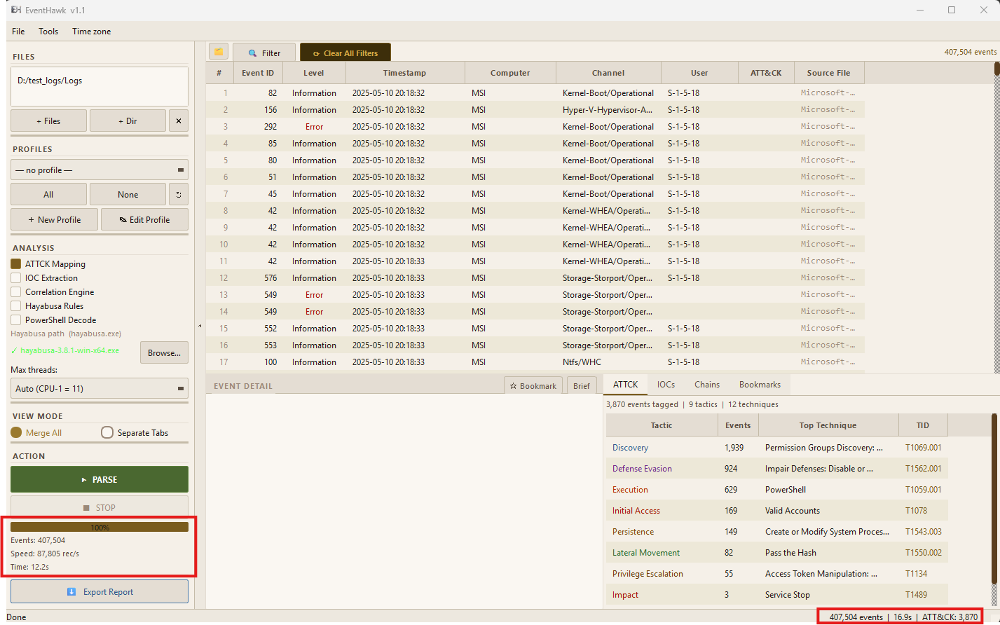

# Normal Mode

## What It Is

Normal Mode is the default parsing engine. It reads `.evtx` files using multiple parallel processes, applies your chosen profile filter, and loads the matching events into an in-memory Qt model that backs the events table. Every matched event is held in RAM for instant access.

Use Normal Mode for datasets up to approximately **1 million events** or when your machine has 8+ GB of RAM. For larger datasets, see [Juggernaut Mode](04-juggernaut-mode.md).

---

## How It Works (Internal)

1. **File discovery** — EventHawk scans all added files and folders for `.evtx` files.
2. **Worker pool** — A `ProcessPoolExecutor` spawns `(CPU count − 1)` worker processes. Each worker handles one `.evtx` file at a time.
3. **Per-file parsing** — Each worker calls `pyevtx-rs` (Rust-speed binary parser) to read events from the file, applies the profile filter inline, and returns matching events to the main process.
4. **Resource monitoring** — A background thread watches CPU and RAM. If CPU exceeds 85% it throttles the worker queue via a semaphore to prevent system freeze.
5. **Model load** — Matched events stream into the Qt `EventTableModel`. The table updates live as each file finishes.
6. **Analysis** — After all files complete, analysis modules (ATT&CK mapping, IOC extraction, etc.) run on the full event set.

---

## When to Use Normal Mode

| Situation | Recommendation |
|---|---|
| Dataset under 1M events | Normal Mode ✓ |
| Machine has 4 GB RAM | Normal Mode up to ~500K events |
| Machine has 8 GB+ RAM | Normal Mode up to ~1M events |
| Need fastest possible parse | Normal Mode (no Parquet overhead) |
| Dataset over 1M events | Switch to [Juggernaut Mode](04-juggernaut-mode.md) |
| RAM under 4 GB | Juggernaut Mode even for smaller sets |

---

## Step-by-Step Usage

**1. Add files or a folder**

In the left panel:
- Click **Add Files** → select one or more `.evtx` files.
- Click **Add Folder** → EventHawk recursively finds all `.evtx` files in that folder.
- Or drag-and-drop files directly onto the left panel.

**2. Choose a profile (optional)**

From the profile dropdown, select a DFIR profile such as "Logon/Logoff Activity" or "Process Creation". This pre-filters events to only those event IDs relevant to that investigation type. Leave as **All Events** to parse everything.

See [DFIR Profiles](14-profiles.md) for the full list and how to create custom profiles.

**3. Configure analysis options (optional)**

Tick the analysis checkboxes you want:
- ATT&CK Mapping
- IOC Extraction
- Correlation Engine
- Hayabusa Rules (requires Hayabusa binary — see [Hayabusa Integration](10-hayabusa.md))

**4. Click Parse**

The status bar shows live progress. Each file completion updates the events table. A progress dialog shows file count and percentage.

**5. Browse results**

Once parsing completes:
- Scroll the events table to browse all matched events.
- Click a row to open it in the [Event Detail Panel](05-event-detail-panel.md).
- Use the [Advanced Filter](06-advanced-filter.md) or [Quick Filters](07-quick-filters.md) to narrow down.
- Check the [Analysis Tabs](09-analysis-tabs.md) for threats, IOCs, and chains.

**6. Re-parse or add more files**

Click **Add Files** again at any time. Clicking **Parse** again clears the current results and starts fresh.

---

## Performance

| CPU cores | Events/sec | 500K events — total time |
|---|---|---|
| 4 cores | ~52 K/s | ~10 s |
| 6 cores | ~74 K/s | ~7 s |
| 8 cores | ~88 K/s | ~6 s |
| 12 cores | ~108 K/s | ~5 s |

> Tested on NVMe SSD. Spinning disk adds ~20–30% time.

**RAM usage:**

| Events | RAM used |
|---|---|
| 100K | ~80 MB |
| 500K | ~350 MB |
| 800K | ~550 MB |
| 1M | ~650 MB |

---

## Limitations

- RAM grows linearly with event count. Above 1M events the process can become slow or crash on low-memory machines — use [Juggernaut Mode](04-juggernaut-mode.md) instead.
- All events must fit in RAM simultaneously. There is no streaming or paging in Normal Mode.
- Re-parse clears existing results — there is no incremental add.
- Sorting a very large event set (900K+) may cause a brief UI freeze while the proxy model re-sorts.

---

## Related Docs

- [Juggernaut Mode](04-juggernaut-mode.md)
- [DFIR Profiles](14-profiles.md)
- [Advanced Filter](06-advanced-filter.md)
- [Analysis Tabs](09-analysis-tabs.md)
- [Event Detail Panel](05-event-detail-panel.md)
