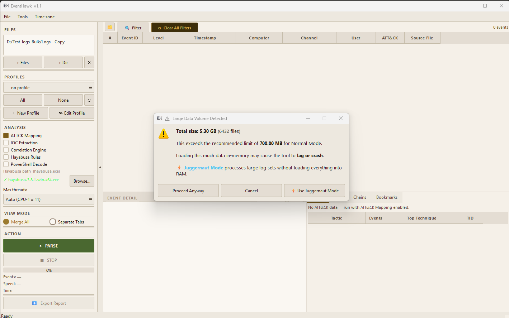
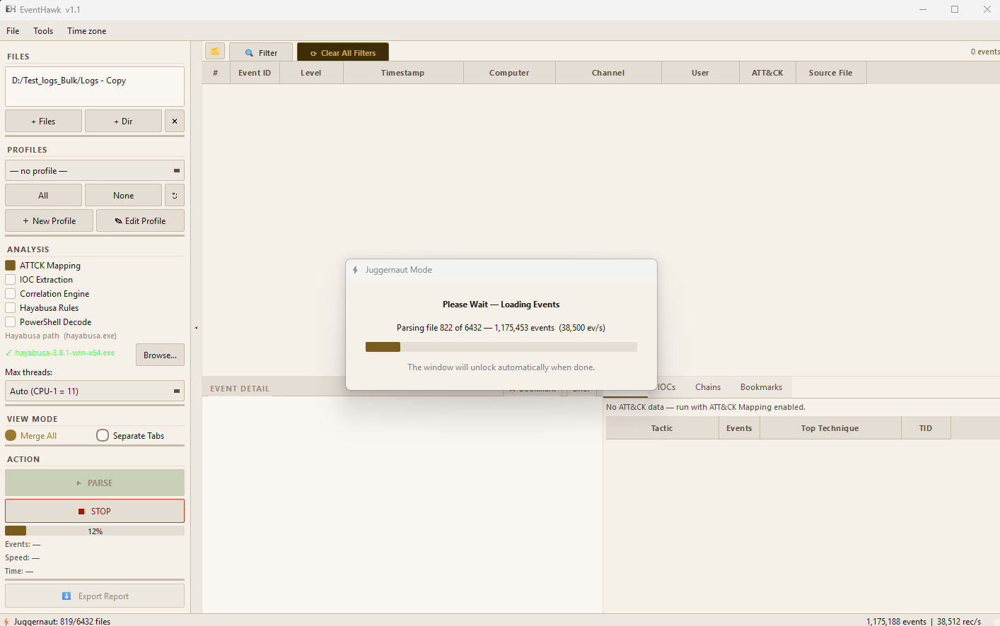
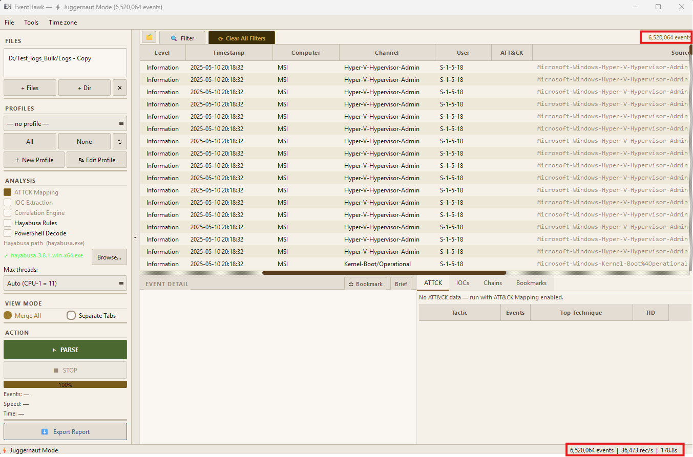

# Juggernaut Mode (JM)

## What It Is

Juggernaut Mode is a high-volume columnar parsing engine designed for datasets that would exceed Normal Mode's RAM limits. Instead of keeping all events in Python objects in memory, it writes events to **Apache Parquet shards** on disk during parsing, then loads only the metadata columns into a compact **Arrow in-memory table**. DuckDB runs vectorised SQL queries directly against this Arrow table — with no disk I/O during scrolling or filtering.

The result: a flat ~280 MB RAM ceiling regardless of whether you have 2 million or 10 million events.

---

## When to Use Juggernaut Mode

| Situation | Recommendation |
|---|---|
| Dataset over 1M events | Juggernaut Mode ✓ |
| RAM under 4 GB | Juggernaut Mode even for smaller sets |
| Long investigations with frequent filter changes | Juggernaut Mode (faster filter response) |
| Need to search inside raw event data (XML bodies) | Juggernaut Mode (Phase 2 Parquet text search) |
| Dataset under 500K events, 8GB+ RAM | Normal Mode is fine |

---

## How It Works (Internal)

Juggernaut Mode has three distinct phases:

### Phase 1 — Parse (multi-process, parallel)

Workers write events to Parquet shards instead of returning them to the main process. Each shard holds 50K rows and is snappy-compressed.

```
evtx files → Worker 1 → shard_000.parquet
           → Worker 2 → shard_001.parquet
           → Worker 3 → shard_002.parquet
           ...
           → parquet_manifest.json  (list of all shard paths)
```

### Phase 2 — Load (single-threaded, fast)

After parsing, the manifest is read and all shards are combined into one Arrow table. Only metadata columns are loaded — the large `event_data_json` column (~500 bytes/row) stays on disk.

```
~114 MB for 6 million rows  (vs ~4 GB if everything were in RAM)
```

Dictionary encoding is applied to 6 low-cardinality string columns (level, channel, provider, computer, user, source_file), compressing them a further 9×.

### Phase 3 — Query (background thread, DuckDB)

A single background `_FilterThread` thread owns one persistent DuckDB connection registered against the Arrow table. All filter requests are sent via a queue. The thread processes only the latest request (stale intermediate requests are discarded), runs vectorised SQL, and returns a filtered Arrow table. Filter latency: 20–120 ms for 6M rows.

### Detail view — Lazy Parquet load

When you click a row, the `event_data_json` for that single event is fetched from the Parquet shards via a temporary DuckDB connection. This takes <20 ms on SSD. The last 100 clicked events are cached in an LRU cache to avoid re-reads.

---

## Step-by-Step Usage

**1. Enable Juggernaut Mode**

Tick the **Juggernaut Mode** checkbox in the left panel before clicking Parse.



**2. Add files and click Parse**

Same as Normal Mode — add files or a folder, select a profile if desired, click **Parse**.

**3. Wait for the two-phase load**

- First bar: "Parsing EVTX files" — writes Parquet shards.
- Second bar: "Loading Arrow table" — reads shards into RAM.



**4. Scroll, filter, and analyse**

The table behaves identically to Normal Mode from the user's perspective. Scrolling is instant — no I/O happens. Filter results appear within 20–120 ms.



---

## Memory Usage

| Events | Arrow table | DuckDB thread | Peak total |
|---|---|---|---|
| 1.6 M | ~30 MB | ~100 MB | ~200 MB |
| 4.0 M | ~75 MB | ~100 MB | ~240 MB |
| 6.0 M | ~114 MB | ~100 MB | ~280 MB |
| 10.0 M | ~190 MB | ~100 MB | ~440 MB |

**Comparison vs Normal Mode:**
```
Normal Mode  — 1M events:  ~650 MB
JM           — 1M events:  ~170 MB  (4× less)
JM           — 10M events: ~440 MB  (hard ceiling)
```

---

## Filter Speed

| Dataset | Simple filter | 5 conditions | 20 conditions | Text search (full) |
|---|---|---|---|---|
| 1.6 M events | 8 ms | 14 ms | 22 ms | ~90 ms |
| 4.0 M events | 18 ms | 28 ms | 45 ms | ~210 ms |
| 6.0 M events | 25 ms | 38 ms | 68 ms | ~310 ms |

Text search includes searching inside raw `event_data_json` via a two-phase Parquet scan. See [Advanced Filter — Text Search](06-advanced-filter.md#text-search).

---

## Temp Files

Parquet shards are written to a system temp folder during parsing. They are **not** deleted after loading — they remain available for detail-view lazy loads and text-search Parquet scans. They are cleaned up when you start a new parse.

Location: `%TEMP%\eventhawk_jm_<session_id>\`

Disk space required: approximately `original EVTX size × 0.4` (Parquet with snappy compression).

---

## Limitations

- **Parse time is longer** than Normal Mode because of Parquet write overhead — approximately 1.5× longer for the same dataset.
- **Text search** in JM scans Parquet shards, so it is slower than metadata-only filters (90–310 ms vs 8–68 ms). This is still fast enough for interactive use.
- **event_data_json not in Arrow table** — detail view requires a Parquet fetch on first click (instant on SSD, ~100–200 ms on spinning disk).
- **Disk space** — Parquet shards use ~40% of original EVTX size. A 10 GB capture needs ~4 GB of temp space.
- **No incremental add** — adding more files requires a full re-parse.
- **Sorting** — sorting by a column re-sorts the in-memory Arrow table. For 10M rows this takes ~1–2 seconds with a brief busy indicator.
- **GPU acceleration** not available on Windows (Linux/WSL2 only).

---

## Related Docs

- [Normal Mode](03-normal-mode.md) — for smaller datasets
- [Advanced Filter](06-advanced-filter.md) — filtering in JM including full-text search
- [Event Detail Panel](05-event-detail-panel.md) — lazy detail loading explained
- [Performance & Scale](19-performance.md)
