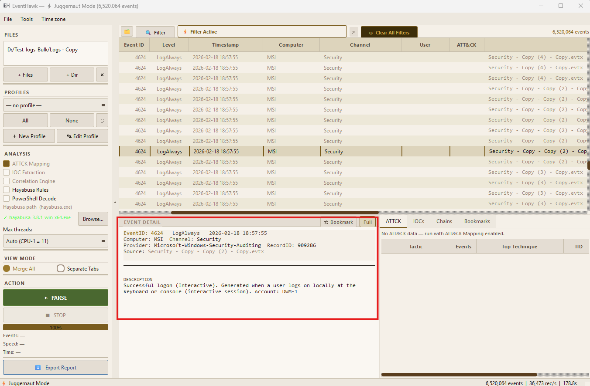
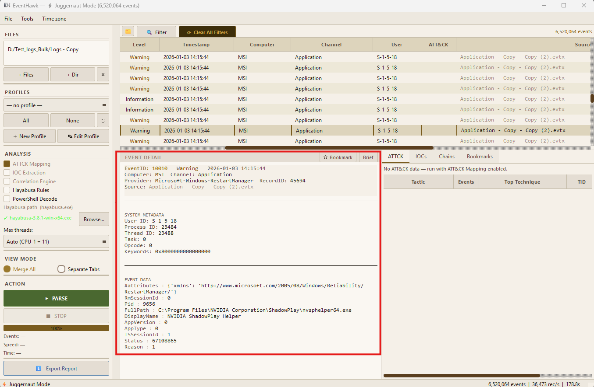

# Event Detail Panel

## What It Is

The Event Detail Panel is the middle section of the centre column. It shows the full content of whichever row is currently selected in the events table. It has two view modes — **Brief** and **XML** — toggled by buttons at the top of the panel.

---

## How to Open It

Click any row in the events table. The detail panel updates immediately (Normal Mode) or after a <20 ms Parquet fetch (Juggernaut Mode, first click per row).

---

## View Modes

### Brief Mode

Shows a single human-readable sentence describing what the event means. EventHawk has rich descriptions for **273+ event IDs** covering the most common Windows security, system, and Sysmon events.

**Examples:**

| Event ID | Brief Description |
|---|---|
| 4624 | `Logon: john@CORP — Interactive (Type 2) from 192.168.1.5 via explorer.exe` |
| 4625 | `Failed logon: admin — Workstation (Type 3) from 10.0.0.44 — Bad password` |
| 4688 | `Process created: cmd.exe (PID 4812) by john — parent: explorer.exe` |
| 4698 | `Scheduled task created: "BackupJob" by SYSTEM` |
| 1116 | `Defender detected: Trojan:Win32/Emotet.A (Severe) in C:\Users\...\payload.exe — Quarantined` |
| 7045 | `New service installed: "SvcHost2" (C:\malware.exe) — Auto-start — SYSTEM account` |
| 4104 | `PowerShell script block logged — 3 chunks (script block ID: abc123)` |

For event IDs without a specific handler, a generic description is shown using the channel and provider name (e.g. "Security audit event from Microsoft-Windows-Security-Auditing").

### XML Mode

Shows the full raw event XML exactly as stored in the EVTX file. This includes the `<System>` header block and the full `<EventData>` or `<UserData>` section with all named data fields.

Useful when:
- You need a specific field not shown in Brief mode.
- You want to copy the raw XML for a report.
- You need to verify field values precisely.

---

## Event IDs with Rich Descriptions (Selected)

| Category | Event IDs |
|---|---|
| **Logon / Logoff** | 4624, 4625, 4634, 4647, 4648, 4649, 4672, 4675 |
| **Account management** | 4720, 4722, 4723, 4724, 4725, 4726, 4738, 4740, 4767 |
| **Group changes** | 4728, 4729, 4732, 4733, 4756, 4757 |
| **Process creation** | 4688 (Security), 1 (Sysmon) |
| **Scheduled tasks** | 4698, 4699, 4700, 4701, 4702 |
| **Services** | 7034, 7035, 7036, 7040, 7045 |
| **Object access** | 4656, 4663, 4660 |
| **Network** | 5140, 5145, 5156, 5157, 5158 |
| **PowerShell** | 4103, 4104 |
| **Defender** | 1006, 1007, 1116, 1117, 1118 |
| **System** | 1074, 6006, 6008, 41, 1076 |
| **Active Directory** | 4706, 4726, 4732, 5136 |
| **Firewall** | 2004, 2005, 2006 |
| **Kerberos** | 4768, 4769, 4771, 4776 |
| **BITS / Transfer** | 59, 60 |
| **RDP** | 1149, 21, 22, 23, 24, 25 |
| **Sysmon** | 1, 3, 5, 7, 8, 10, 11, 13, 15, 22 |

Total: 273+ unique event IDs with specific descriptions. All others receive a generic channel-aware fallback.

---

## Juggernaut Mode — Detail Load Behaviour

In Juggernaut Mode, `event_data_json` is not held in the Arrow table (excluded to save RAM). When you click a row:

1. EventHawk reads the `record_id` from the Arrow table (instant, O(1)).
2. A temporary DuckDB connection scans the Parquet shards for that `record_id`.
3. The `event_data_json` field is returned and parsed.
4. The result is cached in an LRU cache (last 100 events).

**First click:** <20 ms on SSD, ~100–200 ms on spinning disk.
**Repeat click (cached):** Instant.

---

## Limitations

- Brief mode covers 273+ event IDs. For uncovered IDs, the description is generic — it does not attempt to interpret unknown `<EventData>` fields.
- In Juggernaut Mode, the first click on a row that is not cached has a small latency (<20 ms SSD). This is imperceptible in normal use.
- Very long PowerShell script blocks (Event 4104, multi-chunk) may clip in Brief mode — use XML mode to see the full script content.

---

## Related Docs

- [Normal Mode](03-normal-mode.md)
- [Juggernaut Mode](04-juggernaut-mode.md)
