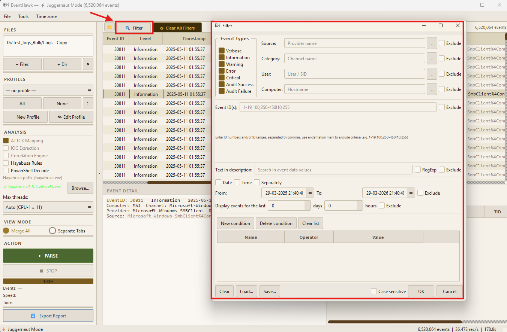

# Advanced Filter

## What It Is

The Advanced Filter dialog lets you narrow the events table to exactly the events you care about. It combines up to eight independent filter conditions using AND logic — only events matching **all** active conditions are shown. Filters work in both Normal Mode and Juggernaut Mode.

---

## How to Open It

Click the **Filter** button in the toolbar. The dialog opens over the main window.

---

## Filter Conditions

### Event ID

Filter by one or more specific event IDs.

| Input format | Example | Result |
|---|---|---|
| Single ID | `4624` | Only Event 4624 |
| Comma list | `4624,4625,4648` | Events 4624, 4625, or 4648 |
| Range | `4600-4700` | All IDs between 4600 and 4700 inclusive |
| Mixed | `4624,4648,7000-7050` | IDs 4624, 4648, and 7000–7050 |

### Level

Multi-select checkboxes. Any combination:
- ☑ Critical
- ☑ Error
- ☑ Warning
- ☑ Information
- ☑ Verbose

Leave all unchecked to show all levels.

### Time Range

Two date+time pickers: **From** and **To**. Events outside the selected range are excluded.

- Both fields accept the format `YYYY-MM-DD HH:MM:SS`.
- Leave **From** blank to include everything before the **To** date.
- Leave **To** blank to include everything after the **From** date.

> **Tip:** Use the timeline feature in the CLI (`evtx_tool.py diff --anchor`) to pre-calculate a window around a known event timestamp.

### Computer

Substring match against the `Computer` field (hostname). Case-insensitive.

- Enter `DC01` to match `DC01`, `dc01.corp.local`, etc.
- Use `corp.local` to match all machines in that domain.

### Provider

Substring match against the Windows event provider name.

| Example input | Matches |
|---|---|
| `Security-Auditing` | Microsoft-Windows-Security-Auditing |
| `Sysmon` | Microsoft-Windows-Sysmon/Operational |
| `PowerShell` | Microsoft-Windows-PowerShell |

### User

Substring match against the `user_id` / subject user field extracted from `event_data_json`. Matches both SIDs and display names.

### Channel

Substring match against the log channel name:
- `Security`
- `System`
- `Application`
- `Sysmon/Operational`
- etc.

### Source File

Substring match against the source `.evtx` filename. Useful when you have loaded multiple files and want to see events from just one.

---

## Text Search

Text search runs across all event fields simultaneously — including the raw `event_data_json` blob (file paths, command lines, IP addresses, registry keys, etc.).

### Modes

| Mode | Behaviour |
|---|---|
| **Contains** | Event must contain the literal string (case-insensitive by default) |
| **Regex** | Event must match the regular expression |
| **Exclude** | Event must NOT contain the string (inverted filter) |

### Case Sensitive

Toggle the **Case Sensitive** checkbox to make Contains/Regex matching case-sensitive.

### Examples

| Search term | Finds |
|---|---|
| `mimikatz` | Any event with "mimikatz" anywhere in its data |
| `192.168.1.` | All events involving that IP subnet |
| `\\AppData\\Roaming` | Suspicious AppData paths |
| `powershell.*-enc` | Regex: PowerShell with encoded command |
| `SYSTEM` + Exclude mode | All events NOT involving SYSTEM account |

### Text Search in Juggernaut Mode

In JM, text search uses a **two-phase approach** to avoid loading `event_data_json` into RAM:

1. **Phase 1** — Arrow table filter: applies all non-text conditions (fast, in-memory).
2. **Phase 2** — Parquet scan: applies text search across all metadata fields + `event_data_json` on the Phase 1 result set only.

This means text search in JM is slightly slower than metadata filters (90–310 ms vs 8–68 ms) but still fast enough for interactive use, and uses **zero additional RAM**.

---

## Applying and Clearing Filters

- Click **Apply** to activate all configured conditions.
- Click **Clear All Filters** in the toolbar to reset every filter layer (Advanced, Quick Filters, Text Search, Record ID) simultaneously.
- Individual conditions can be cleared by blanking their fields and clicking Apply again.

> **Important:** "Clear All Filters" clears **all** active filters including any Quick Filters — not just the Advanced Filter.

---

## Filter Stacking (4-layer model)

EventHawk uses a 4-layer filter stack. All layers are active simultaneously using AND logic:

| Layer | Set by |
|---|---|
| **Advanced filter** | Advanced Filter dialog (this document) |
| **Quick filters** | Quick filter chips in the toolbar |
| **Text search** | Text search section of the Advanced Filter dialog |
| **Record ID filter** | Programmatic — set when pivoting from Analysis tabs |

Each layer can be cleared independently or all at once via **Clear All Filters**.

---

## Limitations

- All filter conditions combine with AND — there is no OR across different field types in the GUI. For OR-logic across fields, use the CLI with a custom filter expression.
- Text search in Normal Mode searches all extracted metadata fields plus `event_data_json`. In JM, a Phase 2 Parquet scan is used — slightly slower.
- Regex in text search uses DuckDB's `regexp_matches()` — standard POSIX regex. Backreferences and lookahead/lookbehind are not supported.
- Date range filter uses UTC timestamps. If your events use local time, adjust accordingly.
- Filtering does not modify the underlying data — it only changes what is displayed. All events remain in memory/Parquet.

---

## Related Docs

- [Quick Filters](07-quick-filters.md)
- [Column Filter Popups](08-column-filters.md)
- [Juggernaut Mode — Filter Speed](04-juggernaut-mode.md)
- [CLI Mode — Filtering](12-cli.md)
