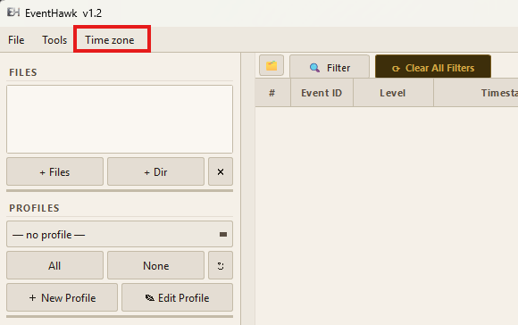
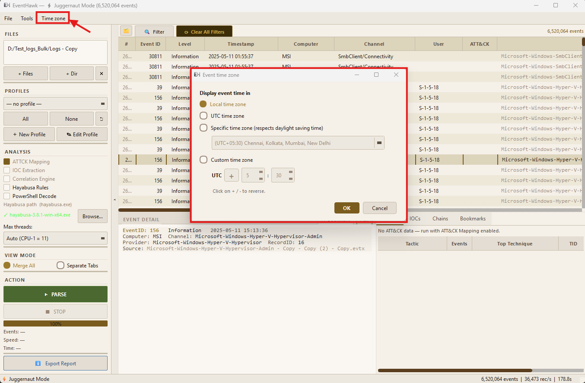

# Timezone Display

## What It Is

All Windows event timestamps are stored in UTC internally. EventHawk can display those timestamps in any timezone you choose — without re-parsing. The change applies instantly to every timestamp in the events table, the event detail panel, and all per-file tabs.

This is important in investigations involving machines in different timezones, or when you need timestamps to match your local working hours for correlation with other evidence.

---

## How to Open It

**View → Time zone** in the menu bar.





---

## The Four Modes

### Local Time Zone

Converts all timestamps to the system's local timezone — whatever Windows is set to on the machine running EventHawk. Daylight saving time is applied automatically.

**Use when:** You are analysing logs from a machine in your own timezone and want timestamps to match what you see in Event Viewer on that machine.

### UTC Time Zone

Displays timestamps exactly as stored — no conversion applied. Format: `YYYY-MM-DD HH:MM:SS` (UTC).

**Use when:** Writing a formal report, correlating with other UTC-based log sources (SIEM, firewall logs), or sharing results with colleagues in different timezones. UTC is unambiguous and recommended for documented evidence.

### Specific Time Zone (IANA)

Converts timestamps to a named timezone selected from a dropdown list. Daylight saving time transitions are handled automatically using Python's `zoneinfo` module (IANA timezone database).

**Use when:** The investigated machine was in a different timezone from yours (e.g. a server in `America/New_York` while you are in `Asia/Kolkata`).

**How to use:**
1. Select **Specific time zone**.
2. Choose the IANA name from the dropdown (e.g. `America/New_York`, `Europe/London`, `Asia/Tokyo`).
3. Click OK.

Common IANA names:

| Region | IANA Name |
|---|---|
| UTC | `UTC` |
| US Eastern | `America/New_York` |
| US Central | `America/Chicago` |
| US Mountain | `America/Denver` |
| US Pacific | `America/Los_Angeles` |
| UK | `Europe/London` |
| Central Europe | `Europe/Berlin` |
| India | `Asia/Kolkata` |
| China | `Asia/Shanghai` |
| Japan | `Asia/Tokyo` |
| Australia East | `Australia/Sydney` |
| Gulf (UAE, etc.) | `Asia/Dubai` |

### Custom Time Zone (Fixed Offset)

Applies a fixed UTC offset in hours and minutes — no daylight saving time adjustment. Useful for timezones that do not follow standard DST rules, or when you know the exact offset but not the IANA name.

**Format:** `UTC +HH:MM` or `UTC -HH:MM`

**Examples:**

| Offset | Region |
|---|---|
| +00:00 | UTC |
| +05:30 | India Standard Time |
| +05:45 | Nepal |
| +09:30 | Australian Central Standard Time |
| -03:30 | Newfoundland Standard Time |
| -08:00 | US Pacific Standard Time (no DST) |

**How to use:**
1. Select **Custom time zone**.
2. Click the `+` / `-` button to set the sign.
3. Adjust the hour and minute spinners.
4. Click OK.

---

## How It Works

EventHawk stores all timestamps internally as UTC strings (e.g. `2025-05-10T18:08:16.313420Z`). When `apply_tz()` is called for display:

1. The UTC timestamp is parsed to a Python `datetime` object.
2. It is converted to the selected timezone using Python's `datetime.astimezone()`.
3. The result is formatted as `YYYY-MM-DD HH:MM:SS` for display.

The raw UTC value is always preserved internally — changing timezone never modifies event data, only the display.

After clicking OK, all visible timestamps update immediately via `layoutChanged` signals on every active model. No re-parse is needed.

---

## Status Bar Indicator

The active timezone is shown in the status bar at the bottom of the window. Examples:

```
Events: 1,621,044  |  Filtered: 4,231  |  TZ: Local
Events: 1,621,044  |  Filtered: 4,231  |  TZ: UTC
Events: 1,621,044  |  Filtered: 4,231  |  TZ: Asia/Kolkata
Events: 1,621,044  |  Filtered: 4,231  |  TZ: UTC+05:30
```

---

## Time Range Filter Interaction

The **From** and **To** fields in the [Advanced Filter](06-advanced-filter.md) always use **UTC** regardless of the display timezone. If you are displaying timestamps in `America/New_York` (UTC-5) and want to filter for events between 14:00 and 15:00 local time, enter `19:00` and `20:00` in the filter fields (UTC equivalent).

---

## Limitations

- The timezone setting is per-session — it resets to **Local** when EventHawk is restarted. A persistent preference is on the roadmap.
- The Specific timezone mode requires Python's `zoneinfo` module, which is included in Python 3.9+. On Python 3.8, it falls back to UTC.
- The Advanced Filter time range fields always accept and compare UTC values — display timezone does not shift the filter boundaries.
- Very old EVTX files from Windows XP era may store timestamps in local time rather than UTC. These will appear offset by the machine's timezone when displayed.
- Juggernaut Mode timestamps are stored truncated to **second precision** (`YYYY-MM-DD HH:MM:SS`) in the Parquet shards — microseconds are not shown in the JM table. They are preserved in the raw `event_data_json` and visible in the XML detail view. Normal Mode shows full microsecond precision.
- Timezone changes apply correctly in Juggernaut Mode — the table redraws immediately after clicking OK.

---

## Related Docs

- [Advanced Filter — Time Range](06-advanced-filter.md#time-range)
- [Event Detail Panel](05-event-detail-panel.md)
- [GUI Overview](02-gui-overview.md)
