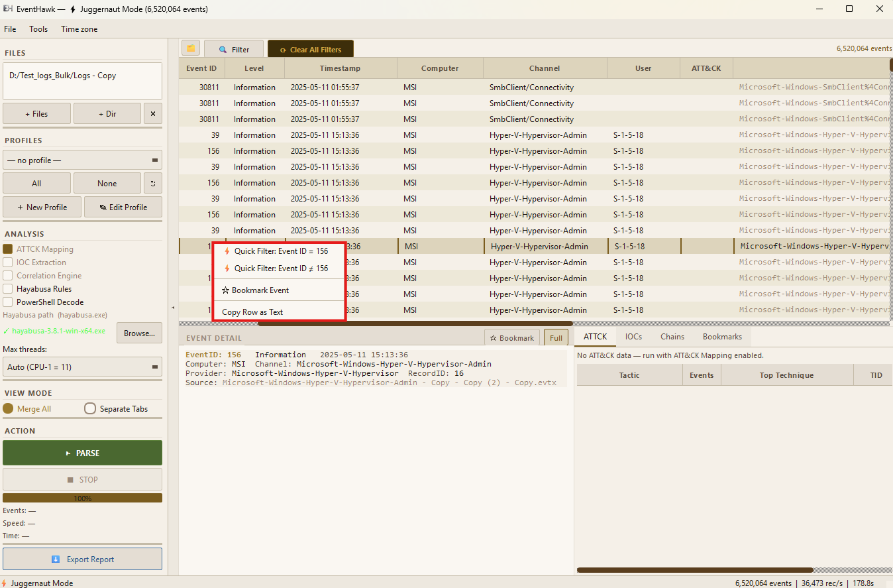

# Quick Filters

## What It Is

Quick Filters are one-click preset filter combinations displayed as chips/buttons in the toolbar. They let you jump to the most common DFIR event subsets without opening the Advanced Filter dialog.

---

## How to Use

**Activate:** Click a Quick Filter chip. The events table instantly narrows to matching events.

**Deactivate:** Click the same chip again to toggle it off, or click **Clear All Filters** to reset everything.

**Combine:** Multiple Quick Filters can be active simultaneously — they combine with AND logic along with any active Advanced Filter conditions.

---

## Available Quick Filters

| Filter | What it shows |
|---|---|
| **Critical** | Only Critical level events |
| **Errors** | Error + Critical level events |
| **Warnings** | Warning + Error + Critical level events |
| **Logon Events** | Event IDs 4624, 4625, 4634, 4647, 4648 |
| **Failed Logons** | Event ID 4625 only |
| **Process Create** | Event IDs 4688 (Security), 1 (Sysmon) |
| **Service Changes** | Event IDs 7034, 7035, 7036, 7045 |
| **Scheduled Tasks** | Event IDs 4698, 4699, 4700, 4701, 4702 |
| **PowerShell** | Event IDs 4103, 4104 |
| **Defender Alerts** | Event IDs 1006, 1007, 1116, 1117 |
| **Account Changes** | Event IDs 4720, 4722, 4724, 4725, 4726, 4738 |
| **Network (WFP)** | Event IDs 5156, 5157 |

---

## Interaction with Other Filters

Quick Filters are one layer in the [4-layer filter stack](06-advanced-filter.md#filter-stacking-4-layer-model). They combine with the Advanced Filter, Text Search, and Record ID filters using AND logic.

**Example:** If you have a time range set in the Advanced Filter dialog AND activate the "Failed Logons" Quick Filter, you will see only failed logon events within that time window.

---

## Limitations

- Quick Filters are fixed presets — you cannot create custom quick filter chips in this version (custom filtering is done in the Advanced Filter dialog).
- Quick Filters and Advanced Filter combine with AND — there is no way to OR between a quick filter and an advanced filter condition.
- Quick Filter state is not preserved between sessions — they reset when you close and reopen the application.

---

## Related Docs

- [Advanced Filter](06-advanced-filter.md)
- [Column Filter Popups](08-column-filters.md)
