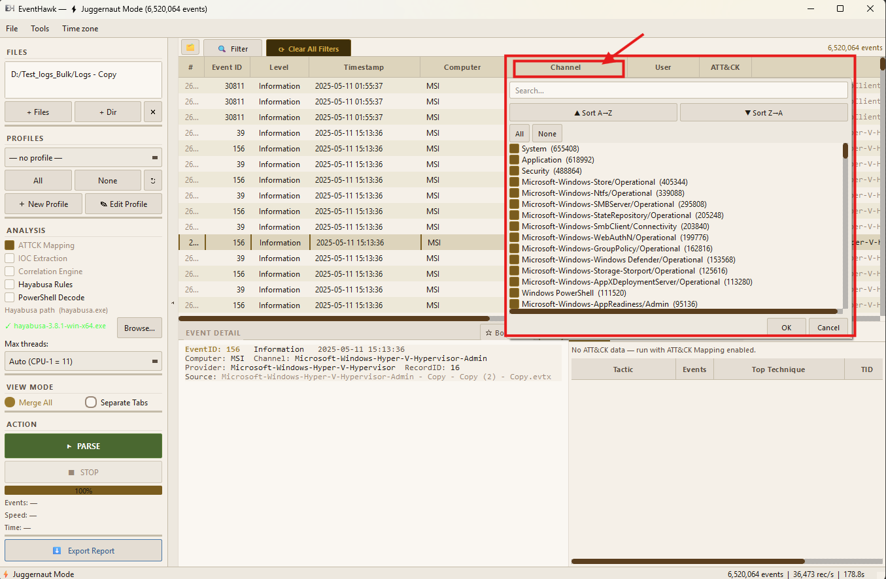

# Column Filter Popups

## What It Is

Column Filter Popups let you filter by distinct values in any column by right-clicking its header. EventHawk runs a background `GROUP BY` query and shows you every distinct value in that column with its event count, so you can tick exactly the values you want.

This is faster than typing into the Advanced Filter when you don't know the exact values in your dataset — you can browse what's there and click.

---

## How to Use

**1. Right-click** any column header in the events table.

**2.** A popup appears showing all distinct values in that column, sorted by frequency (most common first), with event counts.

**3.** Check or uncheck values to include or exclude them.

**4.** Click **Apply** (or the popup closes automatically and applies).



---

## Supported Columns

Column filter popups work on all columns:

| Column | Example values |
|---|---|
| Level | Information, Warning, Error, Critical |
| Computer | DC01, WKS-JOHN, SERVER02 |
| Provider | Microsoft-Windows-Security-Auditing, Sysmon |
| Channel | Security, System, Application |
| User | S-1-5-18, john@corp.local, SYSTEM |
| Source File | Security.evtx, System.evtx |
| EID | 4624, 4625, 4688 … (up to 1000 distinct values shown) |

---

## How It Works in Juggernaut Mode

In JM, the popup query runs via a separate `ColValueWorker` thread that registers the Arrow table in its own DuckDB connection and runs:

```sql
SELECT <column>, COUNT(*) FROM events
WHERE <column> IS NOT NULL
GROUP BY <column>
ORDER BY COUNT(*) DESC
LIMIT 1000
```

The popup appears within ~100–300 ms even on 6M row datasets. The main UI thread is never blocked.

---

## Limitations

- Maximum 1000 distinct values displayed per column. Columns with more than 1000 distinct values (e.g. `Computer` in a large enterprise capture) will be truncated — use the Advanced Filter text field for those.
- The popup reflects the **current filtered view**, not the full dataset. If you already have an Active filter applied, the popup shows distinct values within that filter.
- Popup state is not saved — it resets each time you open it.
- In Normal Mode the GROUP BY runs on the in-memory model, which is instant. In JM it runs a DuckDB query, so expect ~100–300 ms for the first open.

---

## Related Docs

- [Advanced Filter](06-advanced-filter.md)
- [Quick Filters](07-quick-filters.md)
- [Juggernaut Mode](04-juggernaut-mode.md)
