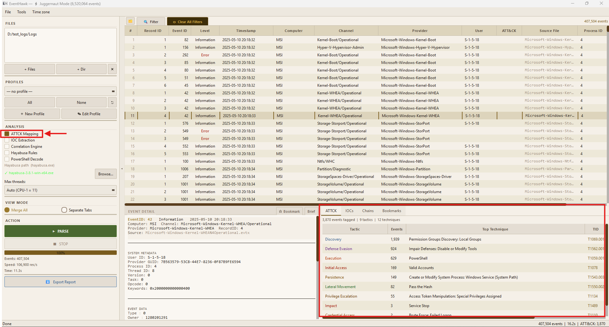
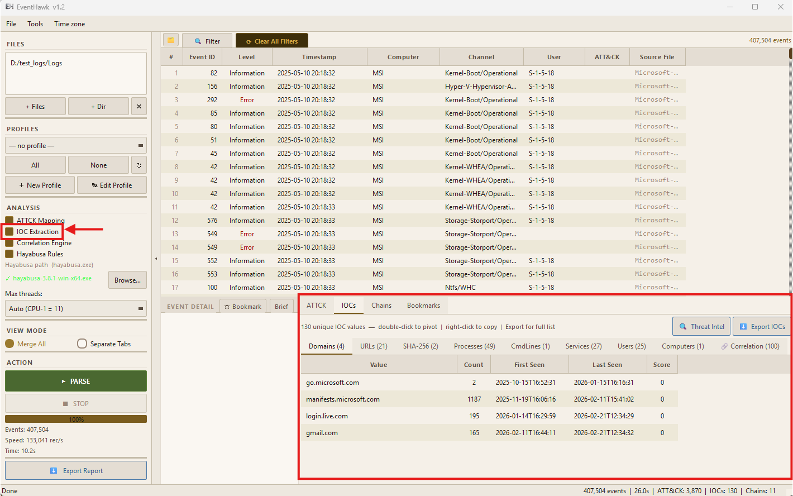
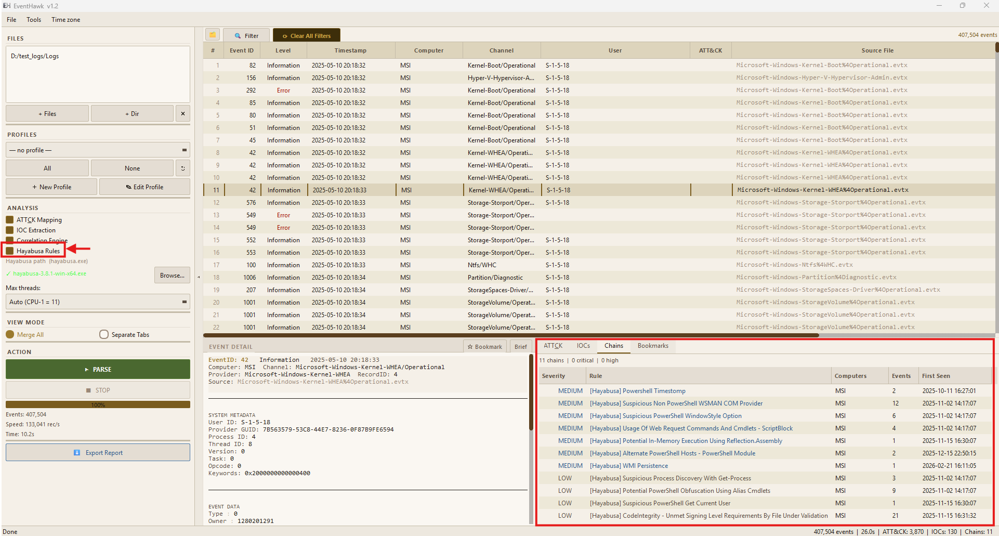

# Analysis Tabs

## What They Are

The Analysis Tabs sit at the bottom of the centre panel and are populated automatically after parsing completes. Each tab runs a specialised analysis module over the full event set and presents results in a structured view. They are independent of the current filter — they always reflect the full parsed dataset.

Four tabs: **ATT&CK**, **IOCs**, **Chains**, **Case**.

---

## ATT&CK Tab

### What It Does

Maps detected events to [MITRE ATT&CK](https://attack.mitre.org/) techniques and tactics. EventHawk's rule engine and (optionally) Hayabusa both contribute detections. Results are de-duplicated and ranked by confidence.

### What Is Shown

| Column | Description |
|---|---|
| Technique ID | ATT&CK technique (e.g. T1059.001) |
| Technique Name | Human-readable name (e.g. PowerShell) |
| Tactic | ATT&CK tactic phase (e.g. Execution) |
| Events | Number of matching events |
| Confidence | High / Medium / Low |
| Source | EventHawk / Hayabusa / Both |

### How to Use

- Click a row to filter the events table to only events that contributed to that technique detection.
- High-confidence findings with large event counts are the most reliable leads.
- If Hayabusa was enabled during parsing, its detections are merged here alongside EventHawk's own rule matches.

### Limitations

- Only event IDs mapped in EventHawk's `attack_mapping.py` are auto-detected. Custom/unknown events are not mapped.
- Confidence levels are heuristic — high-volume Information events can occasionally produce false Medium-confidence matches.
- Hayabusa detections require Hayabusa to be configured and enabled. See [Hayabusa Integration](10-hayabusa.md).

---

## IOCs Tab

### What It Does

Automatically extracts Indicators of Compromise from all events and scores them by threat relevance.

### Extracted IOC Types

| Type | Examples |
|---|---|
| IP addresses | Source IPs from logon events, network connections |
| Domains / hostnames | DNS queries (Sysmon Event 22), RDP target hosts |
| File paths | Process image paths, file access targets |
| File hashes | MD5/SHA1/SHA256 from Sysmon, Defender events |
| URLs | From BITS transfer events, browser events |
| User accounts | Suspicious accounts, newly created users |
| Registry keys | Persistence paths, run keys |
| Command lines | Suspicious cmd/PowerShell arguments |

### How to Use

- Click any IOC row to **pivot** — the events table filters to events containing that indicator.
- High-score IOCs (red) should be investigated first.
- Use **Export → STIX** to export all IOCs as a STIX 2.1 bundle for sharing.
- Use **Export → YARA** to generate YARA rules from file hashes and paths.

### Limitations

- IOC extraction is pattern-based. It can produce false positives for legitimate high-frequency IPs (e.g. domain controllers, DNS servers).
- File hashes are only extracted from events that explicitly log them (Sysmon with hash logging enabled, Defender events). Most standard Windows events do not include hashes.
- Scoring is heuristic — a high score is a signal to investigate, not a confirmed threat.

---

## Chains Tab

### What It Does

Correlates multiple events across time into multi-step attack chains. The engine looks for temporal sequences of related events (e.g. logon → privilege escalation → lateral movement → execution) and reconstructs them as a tree.

### How to Use

- Each chain is shown as a collapsible tree. Expand a chain to see its constituent events in order.
- Click any event node in the chain to jump to that event in the events table.
- Chains are sorted by severity (highest-risk chains at top).
- The chain summary shows: technique sequence, involved computers, time span, and chain score.

### Limitations

- Chain detection uses time-window correlation (default: events within 30-minute windows on the same host). Slow multi-day attacks may not be chained.
- Chains require at least two related events. Single-event detections appear only in the ATT&CK tab.
- Cross-host chains (lateral movement) are detected only if both source and destination logs are loaded.

---

## Case Tab

### What It Does

Lets you mark individual events as case notes — saving them with analyst annotations for inclusion in a formal report.

### How to Use

**1.** In the events table, right-click any row and select **Add to Case**.

**2.** A note dialog appears. Add a comment (e.g. "Suspicious lateral movement from DC01 to WKS-JOHN — matches IOC 192.168.1.44").

**3.** The event appears in the Case tab with your note and a timestamp.

**4.** In the Case tab you can:
   - Edit or delete notes.
   - Re-order entries by drag-and-drop.
   - Click any entry to jump back to that event in the table.

**5.** Click **Export PDF** to generate a formal investigation report containing all case events, their details, your notes, the IOC table, and the ATT&CK matrix summary.

### Limitations

- Case notes are not persisted between sessions by default — export to PDF before closing.
- A session save/load feature is on the roadmap.

---

## Related Docs

- [Hayabusa Integration](10-hayabusa.md) — adds Hayabusa detections to ATT&CK tab
- [Exporting](11-exporting.md) — export IOCs as STIX/YARA, Case as PDF
- [Event Detail Panel](05-event-detail-panel.md)
