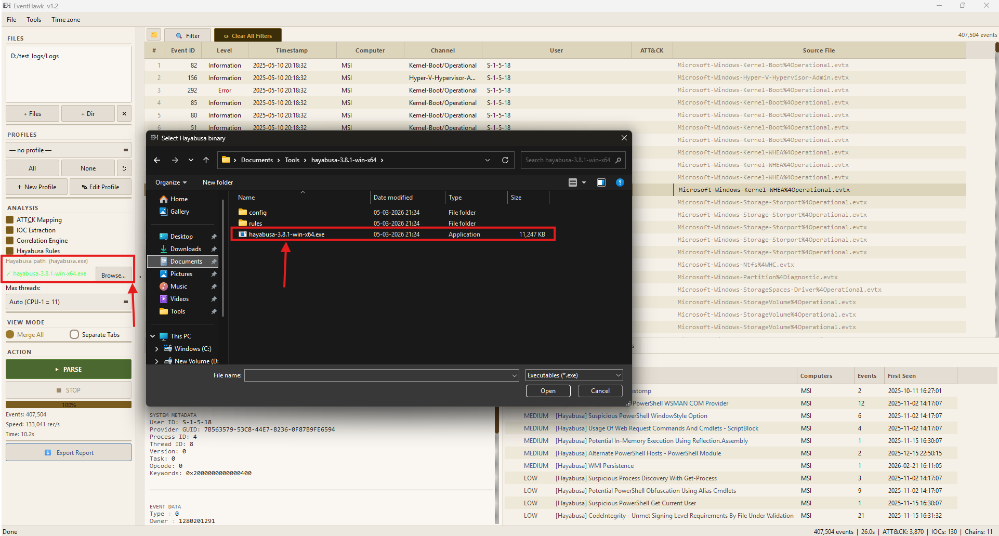

# Hayabusa Integration

## What It Is

[Hayabusa](https://github.com/Yamato-Security/hayabusa) is a fast, open-source Windows event log threat hunting tool by Yamato Security. It ships with ~3,000 community-maintained Sigma-based detection rules covering a wide range of Windows attack techniques.

When Hayabusa integration is enabled in EventHawk, Hayabusa runs as a **background subprocess** against your loaded EVTX files, and its detections are merged into the ATT&CK and Chains analysis tabs alongside EventHawk's own findings.

---

## Prerequisites

1. Download Hayabusa from GitHub (**separate download — not included with EventHawk**).
2. Configure the path in the EventHawk GUI.
3. Enable the Hayabusa Rules checkbox before parsing.

---

## Step 1 — Download Hayabusa

Go to the official releases page:

> **https://github.com/Yamato-Security/hayabusa/releases**

Download the `.zip` for Windows (e.g. `hayabusa-3.x.x-win-x64.zip`). Extract it to a permanent location.

**Recommended install path:**
```
C:\Tools\hayabusa\hayabusa.exe
```

EventHawk automatically checks these paths at startup (no Browse step needed if Hayabusa is in one of them):

```
C:\Tools\hayabusa\hayabusa.exe
C:\hayabusa\hayabusa.exe
C:\Program Files\hayabusa\hayabusa.exe
%USERPROFILE%\hayabusa\hayabusa.exe
%USERPROFILE%\Desktop\hayabusa\hayabusa.exe
%USERPROFILE%\Downloads\hayabusa\hayabusa.exe
```

---

## Step 2 — Configure the Path in EventHawk

If Hayabusa is **not** in one of the auto-detected paths:

1. In the left panel, locate the **Hayabusa Rules** section.
2. Click **Browse…** next to the path label.
3. Navigate to `hayabusa.exe` and click OK.
4. The path label updates: `C:\path\to\hayabusa.exe  ✓`



---

## Step 3 — Enable and Run

1. Tick the **Hayabusa Rules** checkbox.
2. Add your EVTX files and click **Parse** as normal.
3. Hayabusa runs in a **background subprocess** — the GUI remains responsive.
4. When Hayabusa finishes, its detections appear automatically in the **ATT&CK** and **Chains** tabs.

---

## Hayabusa's Built-in Rules

Hayabusa ships with its own curated rule set in the `rules/` subfolder of the extracted archive. **No separate Sigma download is needed for Hayabusa.** Rules cover:

- Process injection
- Credential dumping (LSASS access, SAM hive reads)
- Lateral movement (Pass-the-Hash, Pass-the-Ticket)
- Persistence (registry run keys, scheduled tasks, services)
- Defence evasion (log clearing, UAC bypass, AMSI bypass)
- Command & Control (suspicious outbound connections, BITS abuse)
- Many more (~3,000 rules)

### Updating Hayabusa's Rules

To get the latest rules without downloading a new Hayabusa version:

```bat
cd C:\Tools\hayabusa
hayabusa.exe update-rules
```

This downloads the latest rules from the Hayabusa GitHub repository.

---

## Output and Interpretation

Hayabusa detections appear in:

**ATT&CK Tab:**
- `Source` column shows "Hayabusa" for Hayabusa-originated detections.
- Technique ID and name come from the Sigma rule metadata.
- Confidence maps from Hayabusa severity: `critical` → High, `high` → High, `medium` → Medium, `low` → Low.

**Chains Tab:**
- Hayabusa detections with matching timestamps on the same host are incorporated into correlated chains.

---

## Limitations

- Hayabusa is a **separate binary** — you must download it yourself. EventHawk does not bundle or auto-download it.
- Hayabusa runs synchronously after EventHawk's own analysis. On very large datasets (10M+ events), Hayabusa may take several minutes. A progress indicator is shown.
- Hayabusa's rule set focuses on process, network, and security events. It does not cover every possible event channel.
- Hayabusa requires `.evtx` files on disk — it cannot scan events already loaded in memory. EventHawk passes the original file paths to Hayabusa.
- If the Hayabusa path is wrong or the binary is missing, EventHawk silently skips the Hayabusa step and completes analysis without it. A warning is shown in the status bar.
- Hayabusa is Windows-only in its pre-compiled form. On Linux/macOS you would need to build it from source.

---

## Related Docs

- [Analysis Tabs — ATT&CK Tab](09-analysis-tabs.md#attck-tab)
- [Analysis Tabs — Chains Tab](09-analysis-tabs.md#chains-tab)
- [Sentinel — Sigma Rules](18-sentinel-sigma.md) — separate Sigma integration for Sentinel
