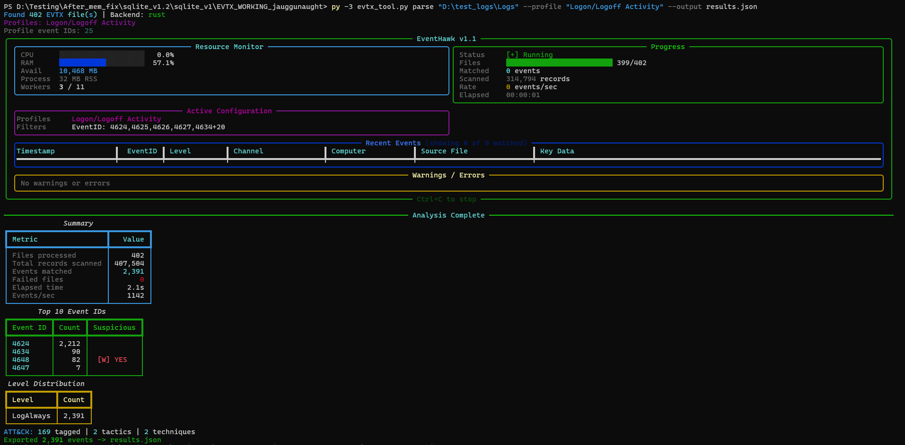

# Terminal UI (TUI) Mode

## What It Is

The TUI (Terminal User Interface) is a live Rich-based dashboard that runs inside the terminal during a CLI parse. It shows real-time CPU and RAM gauges, file progress, events/second throughput, and an overall progress bar — giving you a detailed view of parsing activity without the full GUI.

---

## When to Use It

| Situation | Recommendation |
|---|---|
| Parsing on a server with no display | TUI ✓ |
| Running from an SSH session | TUI ✓ |
| Scripted pipeline but want live progress | TUI ✓ |
| Need results as structured output (JSON/CSV) | CLI without TUI |
| Want full event browsing and filtering | [GUI Mode](02-gui-overview.md) |

---

## How to Enable

Add `--tui` to any `parse` command:

```bat
py -3 evtx_tool.py parse C:\Logs ^
    --profile "Process Creation" ^
    --output results.json ^
    --tui
```

---

## Dashboard Layout

```
┌─ EventHawk v1.1 ────────────────────────────────────────────┐
│                                               [Ctrl+C stop] │
├─ Resource Monitor ──────┬─ Progress ───────────────────────┤
│ CPU ████░░░ 72%         │ Files: [████░░░] 32/47            │
│ RAM ███░░░░ 45%  1.8GB  │ Events matched: 812,041           │
│ Workers: 6 active / 11  │ Records/sec: 88,000               │
│                         │ Elapsed: 00:00:09                 │
├─────────────────────────┴───────────────────────────────────┤
│ Overall:  ████████████████████████████░░░░░░  68%          │
│           9.1s elapsed  /  ~13s estimated total             │
└─────────────────────────────────────────────────────────────┘
```

**Resource Monitor panel (left):**
- CPU usage as animated bar + percentage
- RAM usage as animated bar + absolute value
- Active worker count / total workers

**Progress panel (right):**
- Files completed / total files
- Cumulative events matched so far
- Current throughput (events per second, rolling average)
- Elapsed time

**Bottom bar:**
- Overall progress percentage
- Time elapsed + estimated time remaining



---

## Stopping a Parse

Press **Ctrl+C** at any time. EventHawk cleanly shuts down all worker processes before exiting — no orphaned processes or locked files.

---

## Refresh Rate

The TUI refreshes at 4 frames per second. This is sufficient to see live progress without consuming excessive CPU on the main process.

---

## Limitations

- TUI does not show individual event details — it is a progress monitor only.
- `--tui` and `--juggernaut` cannot be used simultaneously in this version. Juggernaut Mode has its own two-phase progress output in the terminal.
- TUI requires a terminal that supports ANSI escape codes. Standard Windows `cmd.exe`, PowerShell, and Windows Terminal all support this. Very old SSH clients may not render the progress bars correctly.
- The time estimate is a rolling average based on current throughput — it can fluctuate significantly when file sizes vary widely.

---

## Related Docs

- [CLI Mode](12-cli.md)
- [Normal Mode — Performance](03-normal-mode.md#performance)
- [Juggernaut Mode](04-juggernaut-mode.md)
