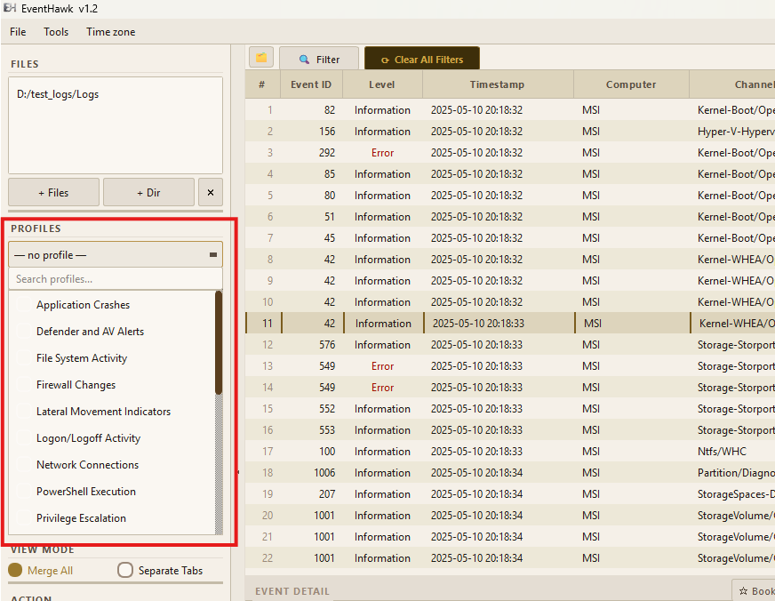
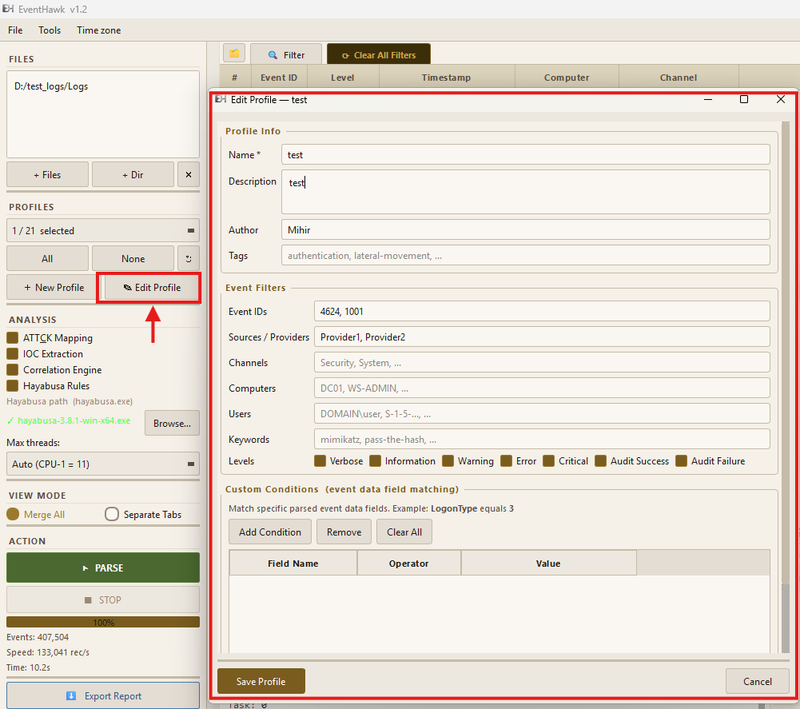

# DFIR Profiles

## What They Are

DFIR Profiles are pre-configured event filters that narrow parsed events to only those relevant to a specific investigation type. Instead of loading every event from every log file (which could be millions of noisy Information events), a profile pre-filters during parsing — only matching events are processed and stored.

This dramatically reduces parse time, memory usage, and noise for focused investigations.

---

## How to Apply a Profile

### In the GUI

1. Open the **Profile** dropdown in the left panel.
2. Select the desired profile.
3. Click **Parse**.

Only events matching that profile's event IDs (and any additional filters) will be loaded into the table.



### In the CLI

```bat
REM By profile name
py -3 evtx_tool.py parse C:\Logs --profile "Logon/Logoff Activity"

REM By profile file path
py -3 evtx_tool.py parse C:\Logs --profile C:\MyProfiles\my_profile.json
```

---

## Built-in Profiles

| # | Profile Name | Key Event IDs | Investigation Use Case |
|---|---|---|---|
| 01 | **User Account Management** | 4720, 4722, 4723, 4724, 4725, 4726, 4738, 4740, 4767 | Track user creation, modification, lockout, deletion |
| 02 | **Logon / Logoff Activity** | 4624, 4625, 4634, 4647, 4648, 4649, 4672, 4675 | All authentication events — interactive, network, service |
| 03 | **Privilege Escalation** | 4672, 4673, 4674, 4697, 4756 | Special privilege assignment, service installation |
| 04 | **RDP Activity** | 4624 (Type 10), 1149, 21, 22, 23, 24, 25 | Remote Desktop sessions — connect, reconnect, disconnect |
| 05 | **PowerShell Execution** | 4103, 4104, 4105, 400, 600 | Script block logging, module logging, engine lifecycle |
| 06 | **Process Creation** | 4688 (Security), 1 (Sysmon) | Every process start — parent/child, command line |
| 07 | **Network Connections** | 3 (Sysmon), 5156, 5157, 5158 | Outbound/inbound TCP/UDP connections |
| 08 | **File System Activity** | 4663, 4656, 4660 | File read/write/delete — requires object access auditing |
| 09 | **Registry Modifications** | 4657, 13 (Sysmon) | Registry value writes — persistence, config changes |
| 10 | **Scheduled Tasks** | 4698, 4699, 4700, 4701, 4702, 106, 141, 200, 201 | Task creation, modification, deletion, execution |
| 11 | **Service Changes** | 7034, 7035, 7036, 7040, 7045, 4697 | Service install, state changes, crashes |
| 12 | **Defender / AV Alerts** | 1006, 1007, 1116, 1117, 1118, 2001 | Malware detection, quarantine, remediation |
| 13 | **Application Crashes** | 1000, 1001, 1002 | Process crashes and hangs — Application log |
| 14 | **USB / Removable Media** | 2003, 2100, 6416, 20001 | USB device connection/disconnection |
| 15 | **Firewall Changes** | 2004, 2005, 2006, 4950, 4951 | Windows Firewall rule add/modify/delete |
| 16 | **Security Policy Changes** | 4739, 4906, 4907, 4912 | Audit policy, domain policy modifications |
| 17 | **Lateral Movement** | 4624 (Type 3), 4648, 5140, 5145 | Network logons, share access, remote execution |
| 18 | **Web Browser Activity** | 1000, 1001 (browser providers) | Browser crashes and activity — limited without Sysmon |
| 19 | **Windows Update** | 19, 20, 43, 44 (WindowsUpdateClient) | Patch installation, failure, rollback |
| 20 | **Boot / Shutdown** | 1074, 6006, 6008, 41, 1076 | System starts, clean shutdowns, unexpected shutdowns |

---

## Creating a Custom Profile

Custom profiles are JSON files. Place them anywhere and reference them by path.

### Profile Schema

```json
{
  "name": "My Custom Profile",
  "description": "Catches persistence mechanisms",
  "version": "1.0",
  "filters": {
    "event_ids": [4698, 4699, 7045, 4697, 13],
    "channels": ["Security", "System", "Microsoft-Windows-Sysmon/Operational"],
    "providers": [],
    "levels": ["Critical", "Error", "Warning", "Information"],
    "keywords": []
  }
}
```

**Field reference:**

| Field | Type | Description |
|---|---|---|
| `name` | string | Display name shown in the profile dropdown |
| `description` | string | Tooltip shown when hovering the profile name |
| `version` | string | Profile version (informational) |
| `event_ids` | int array | List of Windows event IDs to include. Empty = all IDs. |
| `channels` | string array | Log channels to include. Empty = all channels. |
| `providers` | string array | Provider name substrings to match. Empty = all providers. |
| `levels` | string array | Event levels to include. Empty = all levels. |
| `keywords` | string array | Keyword substrings — any event containing these strings passes. |

**All conditions combine with AND.** An event must satisfy every non-empty field.

### Example — Persistence Profile

```json
{
  "name": "Persistence Mechanisms",
  "description": "Scheduled tasks, services, registry run keys, and startup items",
  "version": "1.0",
  "filters": {
    "event_ids": [4698, 4699, 4700, 4701, 4702, 7045, 4697, 4657, 13],
    "channels": [
      "Security",
      "System",
      "Microsoft-Windows-Sysmon/Operational"
    ],
    "providers": [],
    "levels": ["Critical", "Error", "Warning", "Information"],
    "keywords": []
  }
}
```

### Load a Custom Profile

```bat
REM GUI: use the Browse button in the profile section of the left panel
REM CLI:
py -3 evtx_tool.py parse C:\Logs --profile C:\MyProfiles\persistence.json
```

### Validate a Profile

```bat
py -3 evtx_tool.py profiles validate C:\MyProfiles\persistence.json
```

---

## Profile Editor (GUI)

A built-in profile editor is accessible from **File → Profile Editor**. It provides a form-based interface for creating and editing profiles without hand-editing JSON.



---

## Limitations

- Profiles filter at parse time — applying a profile after loading requires a full re-parse.
- If `event_ids` is empty, all event IDs pass (no event ID filtering). This is intentional for channel-only or keyword-only profiles.
- The `keywords` filter is a simple substring match on the raw event XML — it is slower than event ID filtering for large datasets.
- Custom profiles must be valid JSON. Use `profiles validate` to check before using.
- The GUI profile dropdown shows only profiles in the `evtx_tool/profiles/defaults/` folder and any profiles saved via the Profile Editor. Profiles loaded by path from CLI are not added to the dropdown permanently.

---

## Related Docs

- [CLI Mode — profiles command](12-cli.md#profiles--manage-dfir-profiles)
- [Advanced Filter](06-advanced-filter.md)
- [Normal Mode](03-normal-mode.md)
