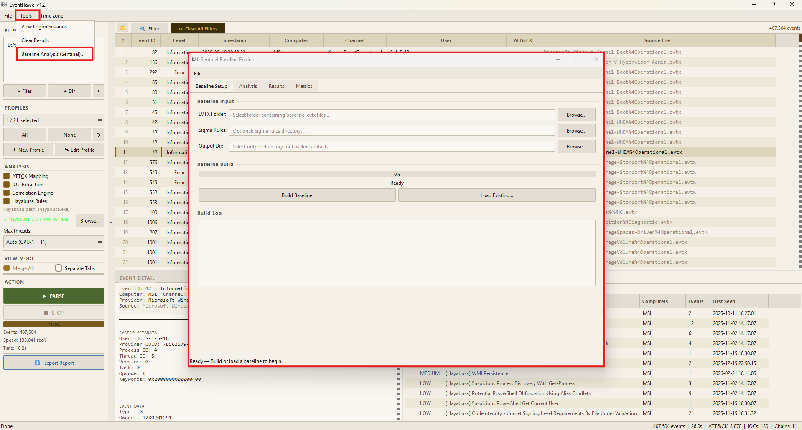

# Sentinel — Building a Baseline

## What It Is

The baseline build is Phase 0 of Sentinel. It processes a known-good EVTX corpus and produces statistical model artifacts that describe normal process behaviour on a system. These artifacts are saved to disk and reused for all subsequent analyses — you only build the baseline once per system (or when normal behaviour changes significantly, e.g. after a major software deployment).

---

## What You Need

### A Known-Good EVTX Corpus

- **Minimum:** 2 weeks of logs from the target system during normal operating hours.
- **Recommended:** 30 days of logs capturing full weekly patterns.
- **Quality requirement:** The corpus must be from a **clean, uncompromised** system. If the system was already compromised during the collection period, the baseline will incorporate attacker behaviour as "normal" and Sentinel will fail to detect it.

### Required log sources (at minimum)

| Log | Why |
|---|---|
| `Security.evtx` | Event 4688 (Process Creation with command-line logging enabled) |
| `Microsoft-Windows-Sysmon/Operational.evtx` | Event 1 (Process Create) — preferred over 4688 as it includes hashes and more fields |

> **Note:** Sysmon must be installed and configured on the source machine to have Sysmon events. If only `Security.evtx` is available, Sentinel uses Event 4688 (requires "Audit Process Creation" + "Include command line in process creation events" GPO settings).

---

## Step-by-Step: Building a Baseline

### CLI

**Step 1:** Collect your known-good EVTX files into one folder:

```
C:\Baseline\
  Security.evtx
  Microsoft-Windows-Sysmon%4Operational.evtx
```

**Step 2:** Run the baseline build:

```bat
python -m sentinel.cli build ^
    --evtx C:\Baseline ^
    --output C:\SentinelBaseline
```

With optional Sigma pre-tagging (recommended):

```bat
python -m sentinel.cli build ^
    --evtx C:\Baseline ^
    --output C:\SentinelBaseline ^
    --sigma C:\sigma\rules\windows
```

See [Sentinel — Sigma Rules](18-sentinel-sigma.md) for how to get the Sigma rules.

**Step 3:** Wait for the 8-step build to complete:

```
[1/8] Parsing EVTX files...           ████████████ 100%  421,880 events
[2/8] Stability check...              ████████████ 100%  Pass (coverage 94.2%)
[3/8] Sigma pre-tagging...            ████████████ 100%  3,201 rules loaded
[4/8] Normalizing events...           ████████████ 100%
[5/8] Building frequency model...     ████████████ 100%  18,441 patterns
[6/8] Building ancestry trie...       ████████████ 100%  depth 5
[7/8] Building fuse filter...         ████████████ 100%  FPR 0.38%
[8/8] Persisting artifacts...         ████████████ 100%  C:\SentinelBaseline

Baseline complete.
  Events processed: 421,880
  Unique processes: 1,847
  Unique lineages:  12,203
  Stability score:  94.2%  (PASS)
  Artifacts saved to: C:\SentinelBaseline
```

**Step 4:** The output folder contains:

```
C:\SentinelBaseline\
  baseline_meta.json       ← metadata (tier boundaries, process distribution, timestamp)
  freq_model.pkl           ← frequency model
  ancestry_trie.pkl        ← process ancestry trie
  fuse_filter.pkl          ← probabilistic membership filter
  artifact_checksums.json  ← HMAC-SHA256 integrity checksums
  baseline.db              ← SQLite event store (for TED forensic queries)
```

These files are all you need for analysis. Keep them somewhere safe — do not delete them.

---

### GUI

1. Launch EventHawk and open the **Sentinel** panel (View → Sentinel, or the Sentinel tab if visible).
2. Click the **Baseline** tab.
3. Click **Add Folder** and select your known-good EVTX folder.
4. Optionally, click **Browse** next to the Sigma rules field and select your rules folder.
5. Set an output directory.
6. Click **Build Baseline**.
7. Monitor the 8-step progress bar.



---

## Stability Check (Step 2)

The stability check validates that your corpus is large enough and representative enough to build a reliable model. It checks:

- **Coverage:** Are all weekdays and hours represented? Low coverage = biased model.
- **Volume:** Are there enough process-create events to build statistically significant frequency counts? Minimum: 10,000 events.
- **Consistency:** Are core system processes (svchost, lsass, services) present with expected frequencies?

If stability check **fails:**
- The build aborts with a descriptive error explaining what is missing.
- Common causes: corpus too small, only weekend logs, system was idle during collection.
- Fix: collect more logs and rebuild.

If stability check produces a **warning** (but does not fail):
- The build continues but the baseline may have elevated false positives.
- Common causes: coverage 70–85% (some hours missing), fewer than 50,000 events.

---

## Build Phase Details

| Step | What It Does |
|---|---|
| **1. Parse** | Reads all EVTX files, extracts process-create events with timestamps, PIDs, PPIDs, command lines |
| **2. Stability** | Validates corpus size, coverage, and consistency |
| **3. Sigma pre-tag** | (Optional) Tags events with ATT&CK technique IDs from Sigma rules — used to avoid training the model on known-malicious patterns |
| **4. Normalize** | Strips paths, normalizes case, canonicalizes command-line arguments |
| **5. Frequency model** | Counts how often each (process, cmdline) pair occurs and builds smoothed probability distributions |
| **6. Ancestry trie** | Builds a trie of all observed parent→child→grandchild chains up to depth 5 |
| **7. Fuse filter** | Builds a probabilistic Bloom-variant filter for fast membership testing of known-good (process, parent, cmdline) triples |
| **8. Persist** | Serializes all artifacts to pickle files in the output directory |

---

## Rebuilding the Baseline

Rebuild when:
- Major software is installed/uninstalled on the target system (new processes appear as anomalies).
- The system's role changes (e.g. developer workstation → build server).
- 90+ days since last build (drift accumulation).

Rebuilding uses the same command with a new `--output` directory or overwrites the existing one.

---

## Limitations

- **Pickle format** — `freq_model.pkl`, `ancestry_trie.pkl`, and `fuse_filter.pkl` use Python pickle serialization. They are not portable between Python major versions (3.10 pickle ≠ 3.12 pickle). Rebuild if you upgrade Python. (`baseline_meta.json` and `artifact_checksums.json` are plain JSON and are portable.)
- **Windows-only** artifacts — the normalizer handles Windows path conventions. Artifacts built on Windows should not be used for Linux log analysis.
- **Single-system baselines** — one baseline = one system profile. Domain-level baselines (averaging across many machines) are not supported in this version.
- **No incremental update** — there is no way to add new logs to an existing baseline. You must rebuild from scratch.
- **Sigma pre-tag dependency** — if `--sigma` is used during build, the same rules directory should be used during analysis for consistent tagging. Mixing rule sets between build and analysis phases is not recommended.

---

## Related Docs

- [Sentinel — Overview](15-sentinel-overview.md)
- [Sentinel — Running Analysis](17-sentinel-analysis.md)
- [Sentinel — Sigma Rules](18-sentinel-sigma.md)
