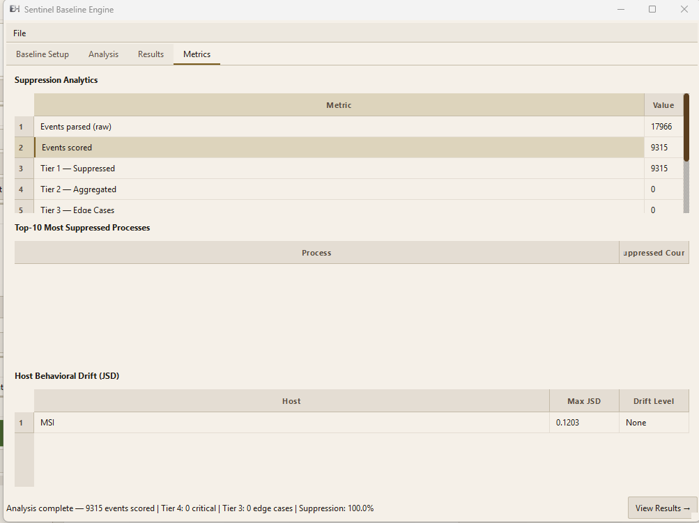

# Sentinel — Running Analysis

## What It Is

Analysis is Phase 1 of Sentinel. It scores every process-create event in a **target** EVTX capture against the baseline artifacts you built in Phase 0. Events that deviate significantly from baseline behaviour receive higher scores and are classified into Tiers 1–4. Tier 3 and 4 events get natural-language justifications explaining why they were flagged.

---

## Prerequisites

- A completed baseline directory (from [Building a Baseline](16-sentinel-baseline.md)).
- Target EVTX files to analyse (the suspected or unknown-state system).

---

## CLI Reference

### Basic analysis

```bat
python -m sentinel.cli analyze ^
    --evtx C:\Target\Security.evtx ^
    --baseline C:\SentinelBaseline
```

### With multiple EVTX files

```bat
python -m sentinel.cli analyze ^
    --evtx C:\Target\Security.evtx C:\Target\Sysmon.evtx ^
    --baseline C:\SentinelBaseline
```

### With Sigma pre-tagging (recommended — use same rules as baseline build)

```bat
python -m sentinel.cli analyze ^
    --evtx C:\Target\Security.evtx ^
    --baseline C:\SentinelBaseline ^
    --sigma C:\sigma\rules\windows
```

### Save a full JSON report

```bat
python -m sentinel.cli analyze ^
    --evtx C:\Target\Security.evtx ^
    --baseline C:\SentinelBaseline ^
    --sigma C:\sigma\rules\windows ^
    --report C:\Reports\incident_2025-05-10.json
```

### Show summary only (no report file)

```bat
python -m sentinel.cli analyze ^
    --evtx C:\Target\Security.evtx ^
    --baseline C:\SentinelBaseline ^
    --summary
```

---

## CLI Options

| Option | Description |
|---|---|
| `--evtx PATH [PATH...]` | One or more target `.evtx` files or a folder |
| `--baseline DIR` | Directory containing baseline artifacts from the build phase |
| `--sigma DIR` | Optional: path to Sigma rules directory for pre-tagging |
| `--report FILE` | Save full JSON report to this file |
| `--summary` | Print summary table to terminal (default if no `--report`) |
| `--min-tier N` | Only report events at or above this tier (1–4, default: 2) |

---

## Analysis Pipeline (What Happens Internally)

**1. Load baseline artifacts**
Frequency model, ancestry trie, fuse filter, and tier boundaries are loaded from the baseline directory.

**2. Parse target EVTX**
All target EVTX files are parsed and sorted by timestamp (chronological order is required for correct lineage tracking).

**3. Sigma pre-tagging (optional)**
If `--sigma` is provided, every event is checked against the Sigma rule set and tagged with matching ATT&CK technique IDs before scoring.

**4. Score each process-create event**

For every Event 4688 or Sysmon Event 1:

| Sub-score | What it measures | Range |
|---|---|---|
| Surprisal (cmdline) | How rare is this exact command-line for this process? High = rarely seen in baseline | 0–100 |
| Surprisal (lineage) | How rare is this parent→child pair? | 0–100 |
| Trie depth score | Is the ancestry chain deeper/shallower than baseline expects? | 0–100 |
| PPID mismatch | Does the logged parent PID match the actual running parent? (process injection indicator) | 0 or 1 |
| Host drift | Has this host's process distribution drifted from baseline (Jensen-Shannon divergence)? | 0–100 |

Composite score = weighted sum of sub-scores.

**5. Fuse filter suppression**
If the fuse filter confirms a (process, parent, cmdline) triple as a known-baseline member, the score is capped at `aggregate_max` (Tier 2 ceiling). This prevents normal activity from reaching Tier 3/4 even if individual sub-scores spike transiently.

**6. Tier classification**

| Score | Tier |
|---|---|
| 0–20 | T1 — suppressed |
| 21–45 | T2 — aggregate |
| 46–70 | T3 — highlight |
| 71+ | T4 — critical |

**7. Justification generation (Tier 3 and 4 only)**
Natural-language justification text is generated for each Tier 3/4 event explaining which sub-scores contributed and why the behaviour is unusual relative to baseline.

---

## Reading the Output

### Terminal summary

```
Sentinel v0.1.0 — Analysis Complete
Events parsed:    421,880
Events scored:     38,204   (process-create events only)
Tier 1 (normal):  37,811   (99.0% suppressed)
Tier 2 (review):     314
Tier 3 (alert):       72
Tier 4 (CRITICAL):     7

*** 7 CRITICAL ALERT(S) DETECTED ***

  [T1059.001 — PowerShell]  3 event(s)
    2025-05-10T18:08:16Z  powershell.exe <- wscript.exe
    Score=91.2  Lineage: wscript.exe has NEVER spawned powershell.exe in baseline (0 occurrences).
                Cmdline surprisal 87.4: encoded command pattern not seen in baseline.

  [T1003.001 — LSASS Dump]  1 event(s)
    2025-05-10T18:09:44Z  rundll32.exe <- cmd.exe
    Score=84.7  PPID mismatch detected. Cmdline references comsvcs.dll MiniDump.
                Parent cmd.exe spawning rundll32.exe seen 0 times in baseline.
```

### JSON report structure

```json
{
  "header": {
    "report_generated": "2025-05-10T19:00:00Z",
    "baseline_host": "WORKSTATION-01",
    "baseline_period": "2025-04-01 → 2025-04-30",
    "baseline_events": 421880,
    "baseline_stability": 0.94,
    "target_events_scored": 38204,
    "suppression_rate_pct": 99.0,
    "input_file_hashes": {"C:/Target/Security.evtx": "abc123..."}
  },
  "critical_alerts": [
    {
      "technique": "T1059.001",
      "event_count": 3,
      "events": [
        {
          "timestamp": "2025-05-10T18:08:16.313420Z",
          "host": "WORKSTATION-01",
          "process": "powershell.exe",
          "parent": "wscript.exe",
          "score": 91.2,
          "sub_scores": {
            "cmdline_surprisal": 87.4,
            "lineage_surprisal": 20.0,
            "trie_depth": 0.8,
            "ppid_flag": 0.0,
            "host_drift_jsd": 0.41
          },
          "justification": "Lineage: wscript.exe has NEVER spawned powershell.exe..."
        }
      ]
    }
  ],
  "edge_cases": [ ... ],   // Tier 3 events
  "metrics": {
    "events_raw_total": 421880,
    "events_scored": 38204,
    "tier1_suppressed": 37811,
    "tier2_aggregate": 314,
    "tier3_highlight": 72,
    "tier4_critical": 7,
    "suppression_rate_pct": 99.0,
    "top10_suppressed_processes": [...],
    "max_score": 91.2,
    "mean_score": 8.4
  }
}
```

---

## GUI Usage

1. Open EventHawk and navigate to the **Sentinel** panel.
2. Click the **Analysis** tab.
3. Add your target EVTX files.
4. Set the baseline directory.
5. Optionally set the Sigma rules path.
6. Click **Run Analysis**.
7. View results in the **Results** tab — Tier 4 critical alerts in red (grouped by ATT&CK technique), Tier 3 edge cases in orange. Check the **Metrics** tab for suppression analytics and host drift summary.



---

## Interpreting Results

**High suppression rate (>98%) = baseline is well-matched to the target**
This is the expected outcome for clean or lightly-compromised systems. A 99% suppression rate with a handful of Tier 3/4 alerts is ideal — it means noise is suppressed and genuine anomalies stand out.

**Low suppression rate (<90%) = possible issues:**
- Baseline was built from a different system or workload.
- Target system has undergone major changes since baseline was built (new software).
- Target may be heavily compromised (many anomalous processes).

**Many Tier 4 alerts on unmodified system = possible baseline quality issue:**
- Rebuild baseline with more data.
- Check that the baseline was built from the same system type.
- Ensure Sigma pre-tagging uses the same rules during build and analysis.

---

## Limitations

- Only Event 4688 (Security) and Sysmon Event 1 are scored. Other event types are used for lineage tracking only.
- Analysis can only score what is present in the target EVTX files. If process creation logging was disabled, Sentinel has no events to score.
- Tier 4 is a strong signal but not a confirmed IOC. Investigate the justification before concluding compromise.
- Very short target captures (<1 hour of logs) may produce elevated false positives because transient host-drift is not averaged out.
- The JSON report can be large for datasets with many Tier 2 events. Use `--min-tier 3` to limit output to Tier 3+ only.

---

## Related Docs

- [Sentinel — Overview](15-sentinel-overview.md)
- [Sentinel — Building a Baseline](16-sentinel-baseline.md)
- [Sentinel — Sigma Rules](18-sentinel-sigma.md)
